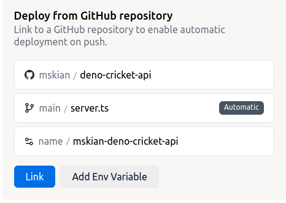

# Deno Cricket API 🦕 🏏

[](https://github.com/mskian/deno-cricket-api/actions/workflows/test.yml)
[](https://github.com/mskian/deno-cricket-api/actions/workflows/release.yml)


Live Cricket Score JSON API - Build using Deno 🦕

## Prerequisites 📕

- Deno on your System <https://deno.land/#installation>
- Denon for Development Server and Live Changes -
  <https://github.com/denosaurs/denon>

## Methods Used 🔧

- oak middleware framework for Deno's native HTTP server -
  <https://github.com/oakserver/oak>
- cheerio for data Scrape - <https://github.com/mskian/deno-cheerio-js>
- Cors - <https://github.com/tajpouria/cors>
- API rate limit - <https://github.com/AdityaTD/oak-rate-limit>

## Testing ⚙

- Development

```sh
denon run --allow-net --allow-read server.ts

or

deno task dev
```

- Production

```sh
deno run --allow-net --allow-read server.ts

or

deno task start
```

## API URL 🔵

- Live Match - `http://localhost:3000/live`
- Get Match Score by ID - `http://localhost:3000/match/<MatchID>`
- Update live Match URL in `/data/config.json`

## Hosting Support and Setup 📦

You can Host this on your own server or use Deno Deploy just connect it via
GitHub 👇

- Fork this Project on your Github Repo
- Link your Forked Project Repo on Deno Deploy, and `main` Branch to deploy
- Next, Choose the deploy option to automatic and Link the `server.ts` file to
  Start the API Server
- Finally, Click the **Link** Button to Connect the repo for Continous auto
  deploy



**Note** : `server.ts` is the Main file to Start API server if you are Hosting
this on your Server don't Forget to install deno and denon (For Local Testing)

```sh
# Production Start
deno task start

or

deno run --allow-net --allow-read server.ts
```

- Download the Project from Release Tag:
  <https://github.com/mskian/deno-cricket-api/releases> or use git to clone the
  Project repo on your Server
- Create Systemd.service file to run the app forever
- You can change the Port No on `server.ts` file
- Update CORS Headers to allow Specific websites to access the API -
  `/lib/router.ts`
- Use Nginx reverse proxy for DENO api server

> self Host this API Service for 100% Uptime ⬆

- Personally, I recommended **Deno deploy** - they offer a Free plan too
- For More About Deno Deploy Refer - <https://deno.com/deploy>

## Todo 🗃

- [x] Random User Agent
- [ ] API Caching
- [ ] Display Live Match ID No's in seperate API router

## Other Live Score API Projects 🗂

- Free Live Cricket Score API (PHP) - <https://github.com/mskian/cricket-api>
- Live Cricket Score JSON API (Node.js) -
  <https://github.com/mskian/cricket-api-nodejs>

## Contributing

Your PR's are Welcome 💚

## Disclaimer ⚠

- This is not an Offical API from Cricbuzz - it's an Unofficial API
- This is for Education Purpose only - use at your own risk on Production Site

## LICENSE ☑

MIT
